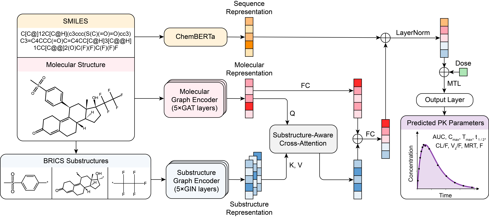

# MMPK



MMPK is an end-to-end multimodal deep learning model for **human oral pharmacokinetic parameters** prediction. It leverages multiple molecular representations learned from molecular graphs, substructure graphs, and SMILES sequences to comprehensively capture multi-scale molecular information. Multi-task learning and data imputation strategies are also employed to improve data efficiency and model robustness. Additionally, the substructure-aware cross-attention mechanism enhances the interpretability of MMPK by identifying chemically meaningful substructures that contribute to the predictions.

**[MMPK Web Server](https://lmmd.ecust.edu.cn/mmpk/)**

## Pharmacokinetic Parameters

MMPK can predict the following eight human oral pharmacokinetic parameters:

- Area under the concentration–time curve (**AUC** [ng*h/mL])
- Maximum plasma concentration (**C<sub>max</sub>** [ng/mL])
- Time to reach C<sub>max</sub> (**T<sub>max</sub>** [h])
- Elimination half-life (**t<sub>1/2</sub>** [h])
- Apparent clearance (**CL/F** [L/h])
- Apparent volume of distribution (**V<sub>z</sub>/F** [L])
- Mean residence time (**MRT** [h])
- Oral absolute bioavailability (**F** [%])

## Environment Setup

Download the repository and create the environment:

```bash
git clone https://github.com/xli7654321/MMPK.git
cd ./MMPK
conda env create -f environment.yml
conda activate mmpk
```

Install PyTorch (with CUDA 11.8 support) after activating the environment:

```bash
pip install torch --index-url https://download.pytorch.org/whl/cu118
```

## Quick Start

### Predict PK Parameters for New Compounds

**👉 We strongly recommend using our [MMPK Web Server](https://lmmd.ecust.edu.cn/mmpk/) for new prediction.**

You can download our trained models from [Zenodo Link](https://zenodo.org/records/15458834). The trained 10-fold MMPK models should be stored in the `checkpoints/` directory, under a folder name specified by the `--checkpoints_folder` argument (e.g., `checkpoints/mmpk/`). 

Use the following command to start prediction:

```bash
python predict.py --checkpoints_folder mmpk --output_file_pred [PREDICTION_FILENAME] --output_file_att [ATTENTION_FILENAME]
```

- `--output_file_pred`: Output filename (`*.csv`) for predicted PK parameters (saved in `prediction/`)
- `--output_file_att`: Output filename (`*.csv`) for substructure attention weights (saved in `attention/`)

After running the command, you will be prompted to select an input mode:

#### Option 1: Manual Input via Terminal

```bash
Please select input mode [1: Manually, 2: CSV file] (default: 1):
> 1

Please enter SMILES (separated by commas):
> Clc1cccc(Cl)c1NC1=NCCN1, NCC(CC(=O)O)c1ccc(Cl)cc1

Please enter administered dose (separated by commas):
> 0.1, 10

Please select dose unit [mg or mg/kg]:
> mg

Do you want to standardize SMILES? [y/n] (default: y):
> y
```

#### Option 2: Load from CSV File

Your CSV file should contain at least two columns: `smiles` and `dose`, and should be placed in the `examples/` directory.

```bash
Please select input mode [1: Manually, 2: CSV file] (default: 1):
> 2

Please enter the path to your CSV file:
> example.csv

Please select dose unit [mg or mg/kg]:
> mg

Do you want to standardize SMILES? [y/n] (default: y):
> y
```

After input is confirmed, the script will summarize the compounds and doses, then begin prediction.

> **Note:** Here, the substructure attention weights are **independent of dose**.

### Reproduce the results of MMPK

We provide the raw datasets at [Zenodo Link](https://zenodo.org/records/15458834). After preprocessing (please following the steps described in the paper), the data for approved drugs should be placed in the `data/approved` directory. Then, you can execute the `split.py` script to split the dataset into training, validation, and test sets.

```bash
python utils/split.py
```

Then, use the following command to run training and evaluation.

```bash
bash run.sh 0 "mmpk" "auc cmax tmax hl cl vz mrt f"
```

The best model checkpoints and prediction results will be saved under the `checkpoints/mmpk/` and `results/mmpk/` directories, respectively.

The script `run.sh` accepts three arguments:

- `DEVICE`: the CUDA device ID to use (default: `0`)
- `FOLDER`: the name of the subfolder under `checkpoints/` and `results/` to store model checkpoints and prediction results (default: `"mmpk"`)
- `PK_PARAMS`: the list of PK parameters to be predicted (default: `"auc cmax tmax hl cl vz mrt f"`)

For external evaluation, you should ensure that the external datasets are placed under the following directories:

- `data/investigational/`
- `data/approved_2024/`

Similarly, the trained 10-fold MMPK models should be stored in the `checkpoints/` directory, under a folder name specified by the `--checkpoints_folder` argument (e.g., `checkpoints/mmpk/`).

```bash
python test.py --checkpoints_folder mmpk
```

This script will load all 10 trained MMPK models and generate averaged predictions for the compounds. The predicted values of each PK parameter for each compound and the overall metrics will be saved under the `results/investigational/` and `results/2024/` directories, respectively.

## License

This project is licensed under the [MIT License](LICENSE).